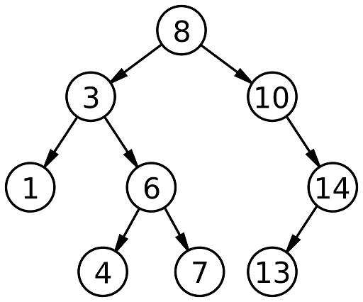

# Tree data structure (树数据结构)
树是非常常见的结构，在这里将几种出名的结构进行简单分析和实现。
## [二叉查找树（Binary Search Tree）](https://en.wikipedia.org/wiki/Binary_search_tree)
BST是比较简单的树结构，满足下面三个性质。
1.若任意节点的左子树不空，则左子树上所有节点的值均小于它的根节点的值；
2.若任意节点的右子树不空，则右子树上所有节点的值均大于它的根节点的值；
3.任意节点的左、右子树也分别为二叉查找树；


## [AVL树 （Adelson-Velsky and Landis Tree）](https://en.wikipedia.org/wiki/AVL_tree)
## [b-树（B-tree）](https://en.wikipedia.org/wiki/B-tree)
## [B+ tree](https://en.wikipedia.org/wiki/B%2B_tree)
## [红黑树 Red–black tree](https://en.wikipedia.org/wiki/Red%E2%80%93black_tree)

## how to build
```
cmake .
make
./tree
```