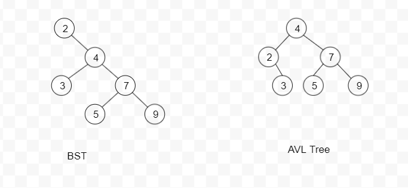
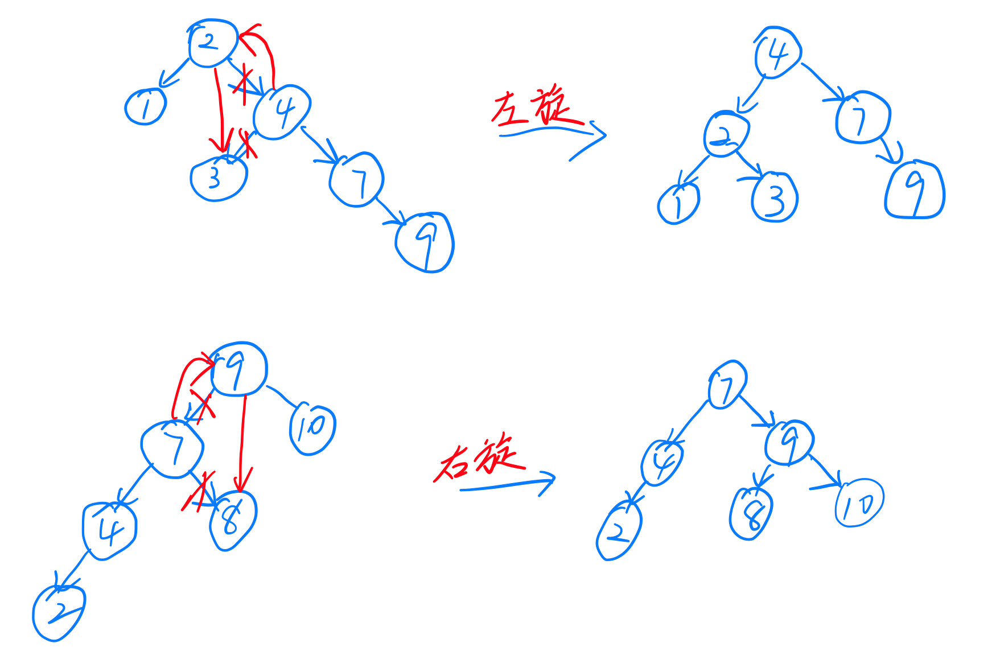
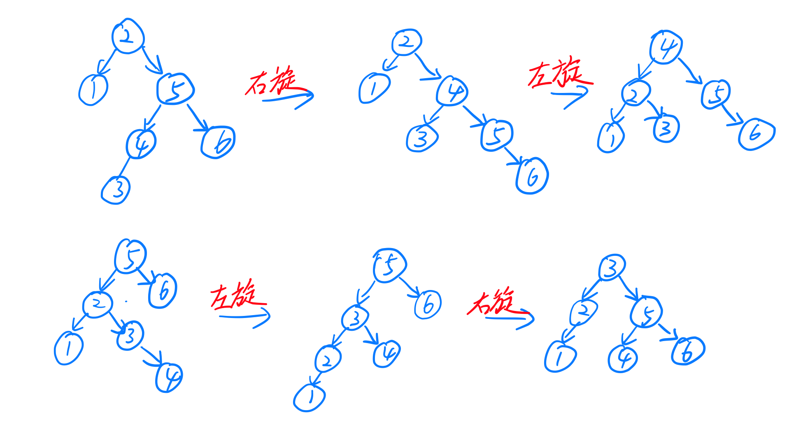

### 平衡二叉查找树
AVL树是带有平衡的二叉查找树，在满足二叉搜索树三个性质的同时保证了任何节点两个子节点高度差最多为1。
通过下图可以看到，同样的插入顺序，但是得到的结构是不一样的。

保证平衡的便是通过在插入和删除节点的时候进行简单的旋转。

#### 旋转
在AVL Tree中旋转分为两种情况，左旋转和右旋转。

先讨论一下左旋，当我们右节点高度大于左节点时，并且右节点下也是右节点高度大于左节点时一般是要进行左旋的，将2的右孩子指向他右孩子4的左孩子3，并将4的左孩子指向2，那么就完成了一次左旋。旋转之后就变成了一个平衡树。右旋转同理。

但当我们右节点高度大于左节点时，右节点下而是左节点高度大于右节点时，单纯的左旋是解决不了的。需要先右旋再左旋。

#### balance
为了保证平衡，我们只需要在有元素变更的时候运行balance函数就可以保证始终是平衡的。