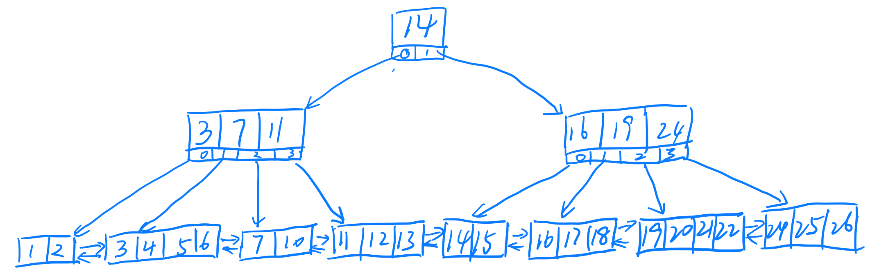

### B+树

上一篇文章讲了b树的实现，这一篇记录一下b+树的实现。b+树相较于b树的区别：

- 数据只存储在叶子节点，非叶子节点只是存放key用于比较。
- 叶子节点之间是相互连接的，可以是单链表或者双向链表。
- 非叶子节点的一个key，右子树中的key永远是大于等于当前key的。

别的也不再赘述了，网上资料很全，主要记录一下[实现](https://github.com/fenglin-Zhou/Tree-structures/blob/main/bplustree.hpp)，这里主要和b树对比。

#### Insert

插入和b树其实基本一样，一直找到叶子节点，找到位置插入数据。插入里面用到几个函数后面细说，比如分裂节点。

#### Remove

删除和b树区别比较大，b树中数据可能在非叶子节点，但是b+树中非叶子节点是没有数据的，但存放了比较值key，也就是说为了删除的某个数据的时候可能需要删除两个地方的数据。不过b+树的特点保证了在非叶子节点中的key一定是对应child中最小值的。（比如删除16，还要删除真正存储数据的叶子节点）。从root_开始，每次向下遍历主要经历一下几个过程：

- 找到第一个大于或等于key的位置index,如果已经是叶子节点并且是要删除的key，那么就直接删除。
- 找到了key并且是要删除的，但是不是叶子节点。如果左孩子节点有大于degree个key，就借一个过来，或者借右孩子，再不行就只能合并了，在循环过程。这里需要值得注意的是借数据和b树不一样。
- - 跟前面的借是我们返回最大值，但是还要直接通过链表将最大值输送到最大值节点的next节点的第一位，因为是在同一个父节点下借数据所以最大值一定是借给next的。然后再删除借到的最大值，并将最大值key放在当前位置。
  - 跟后面借时，需要返回的时最小值的下一位，因为最小值是按照b+树的特性就是我们要删除的值，然后向下删除key。

- 如果key不在，就像下查询，这个过程中的操作和b树基本一样。

不断重复上述过程就完成了remove操作，remove操作比insert是要复杂很多的，主要是涉及到很多种情况。需要分很多情况去讨论。

#### merge函数

merge函数用于合并当前节点的两个相邻子节点，这里和b树不同的是要分开讨论子节点是叶子和非叶子。如果是叶子节点，那么我只直接将右节点的数据全部拷贝过来将左节点next指针跳过右节点。如果是非叶子节点，就和b树一样。

#### splitchild函数

分裂函数和b树不同之处在于需要也是再对叶子节点的处理上，叶子节点需要链表链接，并且叶子节点是将中值上移的同时叶子节点还保存数据。非叶子节点和b树一样。