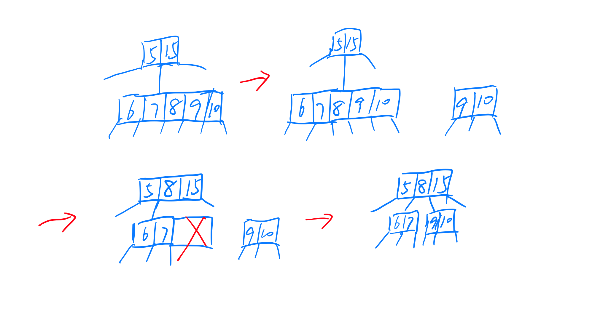

### B-Tree

B-Tree 是一种自平衡搜索树。在大多数其他自平衡搜索树（如 AVL 和红黑树）中，假设所有内容都在主内存中。要理解B-Trees的使用，我们必须考虑无法容纳在主内存中的大量数据。当key个数较多时，数据以块的形式从磁盘读取。与主存储器访问时间相比，磁盘访问时间非常长。使用B树的主要思想是减少磁盘访问次数。大多数树操作（搜索、插入、删除..等）需要 O(h)次磁盘访问，其中h是树的高度。B树是一棵胖树，通过在B-Tree节点中放置最大可能的键来保持B-Tree的高度较低。通常B-Tree节点大小保持等于磁盘块大小。由于B树的高度较低，因此与平衡二叉搜索树（如 AVL 树、红黑树等）相比，大多数操作的总磁盘访问量显着减少。更多的原理也不再赘述，网上资料很多。我们在这里更多的介绍实现。

#### struct设计
首先我们需要定义我们的BTree Node的结构，isleaf_:用来表示当前节点是否是叶子节点，因为BTree的特点是所有的插入操作都是对叶子节点插入数据，初始化的时候root为叶子节点，后面新的都是复制操作或者非叶子节点。degree_:表示这个BTree每个节点可以容纳的数据，非根最少degree-1个，所有最多2*degree-1个。

#### Insert
插入操作相对来说比较简单。和avltree、bst有共同之处。大致就是我们需要通过root_一直找到那个可以插入key值的叶子节点并将数据写入。但在我们查询位置的时候多了一个判断节点数据是否存满的操作。BTree中必须保证每个节点存储的key数量不超过（2*degree-1）个，所以在向下遍历的过程中当遇到节点key数量到（2*degree-1）时，需要对他进行分裂，因为接下来的插入操作可能会导致key数量超过限制。child有效值永远比keys大一个一个，因为BTree下面一定是child[index]中的所有值都是大于keys[index]并小于keys[index+1]的。

#### Search
查询操作和前面两种树是一样的，不断向下遍历，找到key。或者一直到叶子节点还没找到表示并不存在这个key。

#### Remove
相对来说remove操作是最复杂的。这部分的原理很多资料都说过。这里我直接根据代码来分析。大致过程也是找到key的位置再操作。从root_开始，每次向下遍历主要经历一下几个过程：

- 找到第一个大于或等于key的位置index,如果已经是叶子节点并且是要删除的key，那么就直接删除。
- 如果不是叶子节点，那么说明我们要删除的节点是有孩子节点。这里有三种情况考虑: 
- - 当前位置孩子节点有degree及以上个key，那么就从它里面把最大的值（最大值一定是在叶子节点）拿过来覆盖要删除的key，然后在孩子节点中删除借的最大值。
  - 后一个位置孩子节点有degree及以上个key，那么就从它那里把最小的值（最小值一定是在叶子节点）拿过来覆盖要删除的key，然后在后一个位置的孩子节点中删除最小值。
  - 若这两个孩子节点都没有degree个key，那么根据BTree的特点，我们可以合并两个孩子节点再加上这个key，那么还是不会超过（2*degree-1）。再到child_[index]中删除key。

- 第三种情况就是，key不在当前节点了，如果是叶子节点那就不存在这个key。我们首先保存一个flag=(index==keycount)也就是记录目前index是否是最后那个位置。如果当前位置的孩子节点存的key小于degree个，那么我们需要给他借到degree个，其实只需要借一个，因为BTree特性决定了非根节点最少degree-1个key。接下来分两种情况：
- - 之前保存的flag为true，但是index>keycount。可能会疑惑flag不是index==keycount吗，那是因为我们上面执行了借key的操作，如果没借到只能合并两个孩子，如果index是最后一个位置我们合并也只能向前合并。那么造成的结果就是index位置的key下沉到child中。当前节点keycount少了一个，那么我们只能到child[index-1]中删除key了。
  - 另一种就是直接向下到child[index]中删除key。也就是借key借到了，或者需要合并，但是我们不是在最后一个位置，合并也不会影响到向下remove的节点。

不断重复上述过程就完成了remove操作，remove操作比insert是要复杂很多的，主要是涉及到很多种情况。需要分很多情况去讨论。

#### splitchild

splitchild函数是我觉得需要细说的一个函数，两个参数，一个index，一个BTNode指针node。index是我们要分裂的的孩子节点在当前节点的位置，主要作用是将当前节点的孩子节点和key后移一个位置，给分裂的孩子节点的中值一个位置，也就是插入到index中，并且child[index]指向下面创建的新节点。既然是分裂我们需要创建一个新的节点，保存分裂节点的后degree-1个key和后degree个child，那么分裂的child就只剩下degree-1个有效信息了。具体如下图实例。

